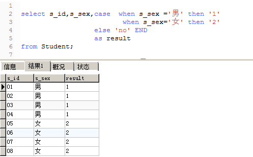
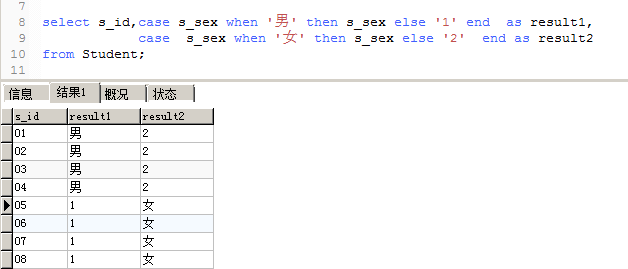

#### 一、MySql数据库地址：

> ip:106.52.178.155 
>
> 用户名:root 密码:rootroot
>
> use MyDatabase
>
> -- 查看SQL_MODE
> SELECT @@sql_mode;
>
> -- 修改SQL_MODE
> SET sql_mode=(SELECT REPLACE(@@sql_mode,'ONLY_FULL_GROUP_BY',''));
>
> 

#### 二、MySQL经典练习题及答案

> 表名和字段
> –1.学生表 
> Student(s_id,s_name,s_birth,s_sex) –学生编号,学生姓名, 出生年月,学生性别 
> –2.课程表 
> Course(c_id,c_name,t_id) – –课程编号, 课程名称, 教师编号 
> –3.教师表 
> Teacher(t_id,t_name) –教师编号,教师姓名 
> –4.成绩表 
> Score(s_id,c_id,s_score) –学生编号,课程编号,分数

-- 1.查询"01"课程比"02"课程成绩高的学生的信息及课程分数
分析：需要查询字段是该学生的所有信息及课程分数，条件是该学生01的课程分数要高于02的课程分数。
 (即Student、Score 2张表内查询)
第一步：先查出01课程的成绩表 

```mysql
SELECT * from Score where c_id='01'; 
```

第二步：先查出02课程的成绩表

```mysql
SELECT * from Score where c_id='02' ;
```


第三步：用where 条件过滤 1.满足同一个人  2.01分数>02分数 

```mysql
SELECT * from 
 (SELECT * from Score where c_id='01')  as s1, 
(SELECT * from Score where c_id='02') as s2 
WHERE s1.s_id=s2.s_id AND s1.s_score>s2.s_score;
```

第四步：生成新的一张表,并给给表字段创建别名

```mysql
SELECT s1.s_id,s1.s_score sc01,s2.s_score sc02  from 
 (SELECT * from Score where c_id='01')  as s1, 
(SELECT * from Score where c_id='02') as s2 
WHERE s1.s_id=s2.s_id AND s1.s_score>s2.s_score;
```

第5步：关联学生表获取学生信息即可

```mysql
select st.s_id,st.s_name,st.s_birth,st.s_sex,sc.sc01,sc.sc02 from Student st join (
SELECT s1.s_id,s1.c_id,s1.s_score sc01,s2.s_score sc02  from 
 (SELECT * from Score where c_id='01')  as s1, 
(SELECT * from Score where c_id='02') as s2 
WHERE s1.s_id=s2.s_id AND s1.s_score>s2.s_score
)sc on st.s_id=sc.s_id;
```

-- 2、查询"01"课程比"02"课程成绩低的学生的信息及课程分数

```mysql
SELECT * from Student  st join (
select  s1.s_id,s1.s_score s01,s2.s_score s02  from 
(select * from Score WHERE c_id='01') as s1,
(select * from Score where c_id='02') as s2
where s1.s_id=s2.s_id and s1.s_score<s2.s_score 
) sc on sc.s_id=st.s_id;
```

-- 3、查询平均成绩大于等于60分的同学的学生编号和学生姓名和平均成绩

```mysql
SELECT st.s_id,st.s_name,sc.sc_v from Student st JOIN (
SELECT  s_id,avg(s_score) as sc_v from Score GROUP BY s_id 
) sc  on sc.s_id=st.s_id  and sc_v>60;
```

-- 4、查询平均成绩小于60分的同学的学生编号和学生姓名和平均成绩

```mysql
  SELECT st.s_id,st.s_name,sc.sc_v from Student st JOIN (
SELECT  s_id,avg(s_score) as sc_v from Score GROUP BY s_id 
) sc  on sc.s_id=st.s_id  and sc_v<60;    
```

-- 5、查询所有同学的学生编号、学生姓名、选课总数、所有课程的总成绩

```mysql
select Student.s_id,Student.s_name, sc.cn, sc.m from Student join (
select s_id,count(c_id) as cn ,sum(s_score) as m from Score GROUP BY s_id 
)sc on Student.s_id=sc.s_id  ORDER BY  sc.m desc ;
```

-- 6、查询"李"姓老师的数量 

```mysql
select count(t_name) from Teacher where t_name like '王%' ;
```

-- 7、查询学过"张三"老师授课的同学的信息 

- 分析：Teacher       t_id 
                Course        t_id      c_id 
                Score           c_id     s_id 
                Student      s_id

第一步：课程表和老师表关联查询姓名为张三老师对应的课程编号c_id （共有字段t_id）

```mysql
select t.tid as tid ,t.tname tname ,c.c_id cid,c.c_name cname  from  Course c  JOIN 
(select t_id tid,t_name tname from  Teacher where t_name='张三') t  on t.tid=c.t_id;
```

第二步：成绩表和第一步中的结果表关联,查询姓名为张三老师的课程编号c_id,对应的成绩表的学生的s_id

```mysql
select c2.tid c2tid ,c2.tname c2tname , c2.cid  c2id,c2.cname c2cname,  sc.s_id scsid, sc.s_score scscore from Score as  sc join
 (select t.tid  tid ,t.tname tname ,c.c_id cid,c.c_name cname  from  Course c  JOIN  (select t_id tid,t_name tname from  Teacher where t_name='张三') t  on t.tid=c.t_id ) 
c2
 on sc.c_id=c2.cid;
```

第三步：学生表和上一步的结果表关联查询学生信息

```mysql
SELECT st.s_name,st.s_birth,st.s_sex ,w.c2tid ,w.c2tname , w.c2id,w.c2cname,  w.scsid, w.scscore FROM  Student st join
 (select c2.tid c2tid ,c2.tname c2tname , c2.cid  c2id,c2.cname c2cname,  sc.s_id scsid, sc.s_score scscore from Score as  sc join
 (select t.tid  tid ,t.tname tname ,c.c_id cid,c.c_name cname  from  Course c  JOIN  (select t_id tid,t_name tname from  Teacher where t_name='张三') t  on t.tid=c.t_id ) c2 on sc.c_id=c2.cid)
 w on w.scsid=st.s_id;
```

-- 8、查询没学过"张三"老师授课的同学的信息 

待：

-- 9、查询学过编号为"01"并且也学过编号为"02"的课程的同学的信息

```mysql
select * from  Student st ,Score sc1,Score sc2
                 where st.s_id=sc1.s_id  and st.s_id=sc2.s_id  and sc1.c_id='01' and sc2.c_id ='02';
```

-- 10、查询学过编号为"01"但是没有学过编号为"02"的课程的同学的信息

```mysql
select st.* from Student  st where st.s_id in (select s_id from Score where c_id='01' ) and st.s_id not in (select s_id from Score where c_id='02');
```

-- 时间相关函数

1.DATE_FORMAT(date,format) 函数用于显示日期或时间数据的不同样式。
1.1参数：date 合法的日期；format 最终输出的日期/时间；

```mysql
select date_format('1995-08-08','%Y-%m-%d') as 自定义时间;
```

2.NOW()函数：当前时间

```mysql
select date_format(now(),'%Y-%m-%d') as 自定义时间;
```

3.CONCAT（）函数用于将多个字符串连接成一个字符串

```mysql
select CONCAT('当前时间',now()) as time
```

4.WEEK(date, mode)：date是要获取周数的日期 ;mode是一个可选参数，用于确定周数计算的逻辑
5.MONTH(date):函数返回一个整数，表示指定日期值的月份

6.SQL语句 CASE WHEN的用法

```mysql
select s_id,s_sex,case  when s_sex = '男' then '1'
                        when s_sex = '女' then '2'
                  else 'no' END
                  as result           
from Student;
```



```mysql

select s_id,case s_sex when '男' then s_sex else '1' end  as result1,
            case  s_sex when '女' then s_sex else '2'  end as result2 
from Student;
```



-- 11、查询没有学全所有课程的同学的信息

```mysql
select s.* from 
    Student s where s.s_id in(
        select s_id from Score where s_id not in(
            select a.s_id from Score a 
                join Score b on a.s_id = b.s_id and b.c_id='02'
                join Score c on a.s_id = c.s_id and c.c_id='03'
            where a.c_id='01'))
```

-- 12、查询至少有一门课与学号为"01"的同学所学相同的同学的信息 

```mysql
SELECT * from Student where s_id in (
                      SELECT distinct s_id from Score where c_id in (select c_id from Score where s_id='01'));
```

-- 13、查询和"01"号的同学学习的课程完全相同的其他同学的信息 

```mysql
select a.* from student a where a.s_id in(
    select distinct s_id from score where s_id!='01' and c_id in(select c_id from score where s_id='01')
    group by s_id 
    having count(1)=(select count(1) from Score where s_id='01'));
```

待：    having count(1)=？不懂这里语法

-- 47、查询本周过生日的学生  

```mysql
SELECT * from Student where  week(now()) =week(s_birth) ;
```

-- 48、查询下周过生日的学生 

```mysql
select * from Student where week(now())+1 = week(s_birth);
```

-- 49、查询本月过生日的学生

```mysql
select * from Student where month(now())=month(s_birth);
```

-- 50、查询下月过生日的学生

```mysql
select * from Student where month(now())+1=month(s_birth);
```

